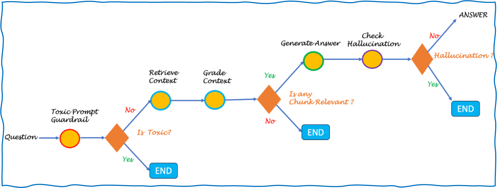

# Agentic RAG

> This is a self-correcting RAG pattern that checks the retrieved contexts for relevancy and the generated answers for hallucinations.\ It is loosely based on this Self-RAG [paper](https://arxiv.org/abs/2310.11511)\

## Table of Contents
- [Introduction](#introduction)
- [Features](#features)
- [SneakPeek](#sneakpeek)
- [Prerequisites](#prerequisites)
- [Installation](#installation)
- [Usage](#usage)
- [License](#license)
- [Acknowledgements](#acknowledgements)

## Introduction

This project is a self-correcting RAG pattern that checks the retrieved contexts for relevancy and the generated answers for hallucinations.\ 
It is loosely based on this Self-RAG [paper](https://arxiv.org/abs/2310.11511)\

## Features

- The toxic_rail_experiment.ipynb notebook is complete implementation of a toxic comment classifier using embeddings and a Random Forest model
- The self-correcting RAG is implemented in the agentic_rag_index.ipynb and agentic_rag_generate.ipynb notebooks.

Details of the implementation are in the notebooks.
The toxic_rail_experiment.ipynb notebook is an experimental implementation of guardrails functionality. A opinionated take is that checking the incoming prompts for toxicity or the domain fit is a classification problem. While LLMs can be used for classifying toxicity, this approach might not work reliable for scenarios that need filtering non-toxic incoming questions that do not fit into the intended domain. For example, fitering out questions based on competitors or out-of-bound subject areas. When there is a greater control needed, there are colorful choices of classic algorithms like RandomForest classification. When used with embeddings as the features, they are expected to perform better than ever. So, here is an experimental implementation presented in toxic_rail_experiment.ipynb

## SneakPeek

\
- The LLM used in this is llama3:8b. The embedding model used is mxbai-embed-large (1024 dimensions). Both are ran locally using ollama
- The chunking is done using SemanticSplitter which helps to split meaningfully complete blocks\
- FAISS (Facebook AI Similarity Search) is a popular library for efficient similarity search and clustering of dense vectors. Used IndexFlatL2 for Simple exact search and LlamaIndex to provide a higher-level interface to FAISS
- Used langgraph to compose the workflow. It brings loose coupling and the ability to assemble functionality as in the diagram

There is also an experimental implementation of guardrails functionality. A opinionated take is that checking the incoming prompts for toxicity or the domain fit is a classification problem. While LLMs can be used for classifying toxicity, this approach might not work reliable for scenarios that need filtering non-toxic incoming questions that do not fit into the intended domain. For example, fitering out questions based on competitors or out-of-bound subject areas. When there is a greater control needed, there are colorful choices of classic algorithms like RandomForest classification. When used with embeddings as the features, they are expected to perform better than ever. So, here is an experimental implementation presented in toxic_rail_experiment.ipynb

## Installation
Install the following:

### Python & Pip installation
    -   brew install python@3.10
    -   brew install pip3
    -   set python3 alias
        -   alias python=python3
        -   alias pip=pip3
        apply this using . ~/.bashrc from terminal     
    -   check from terminal
        -   python -version
        -   pip -version

### Clone the repository:
    ```bash
    git clone https://github.com/bhuvana-s/agentic-rag.git
    ```
### Setup virtual environment
    Make sure to clone the GitHub repo and try to setup the virtual environment in that repo
    -   python3 -m venv .venv
         [Note: -m stands for module. Its about creating a virtual env and we named it as ".venv". You need not even have . while creating the environment name. Anytime we install python packages, it gets installed in this directory.]

    -   ls -a # list all files including hidden files
    -   source .venv/bin/activate   
        [Note: You need to run this first time when you create virtual env and also when you restart the system or just you are out of the virtual env]


### Install Jupyter Notebooks
Python is an interpreted programming language, meaning it runs directly from source code without the need for compilation. While Python itself runs on local servers, machine learning tasks often require higher configuration systems. You can host Jupyter on a remote server (e.g., an Amazon EC2 instance), run the necessary commands, and then expose a URL that can be accessed from your local machine or a designated PC.

Data scientists typically use remote GPU servers to run Jupyter notebooks. These servers are hosted remotely, and we can connect to them from our local machines to run computations and access results.

    -   pip install jupyterlab
    -   pip install ipykernel
    -   python -m ipykernel install --user --name .venv
        [Note: This is to create a kernel for the virtual environment. This is needed for the jupyter lab to recognize the python path in the virtual environment. Give meaningful user name like my-python310-kernerl]
    -   jupyter kernelspec list
    
### Start Jupyter Lab
    jupyter lab

    This will launch Jupyter in the browser. If not, look for the URL in the terminal 

   To access the server, open this file in a browser:

        file:///Users/<user name>/Library/Jupyter/runtime/jpserver-73482-open.html

    Or copy and paste one of these URLs:

        http://localhost:8888/lab?token=<token>

        http://127.0.0.1:8888/lab?token=<token>

#### why python 3.10?
This is because the llama3 model is not supported in python 3.11 and above and the present code is originally tested in python 3.10.14, hence downgrade to 3.10.

Steps to downgrade:
$ deactivate # deactivate the current venv
$ brew install python@3.10 # install python 3.10
$ source .venv/bin/activate # activated the venv
$ jupyter lab # start the jupyter lab

### Ollama installation
    -   brew install ollama
    -   brew services start ollama
    -   ollama pull llama3    # This is 4.7 GB
    -   ollama run llama3    # feel free to ask the questions to the llm and to exit, type /bye
    -   ollama pull mxbai-embed-large    # This is 669 MB

Now all set and go to ipynb and execute

### Install dependencies:
    If you are running the notebooks for the first time, you might need to install the dependencies.
    
    ```bash
    pip install -r requirements.txt
    ```

## Usage
Run the notebooks in the order:
1. toxic_rail_experiment.ipynb
    step through toxic_rail_experiment.ipynb where randomforest classifier model will be created. The dataset used for this experiment was taken from this [kaggle dataset](https://www.kaggle.com/c/jigsaw-toxic-comment-classification-challenge/data) \
2. agentic_rag_index.ipynb
    Step through the the agentic_rag_index notebook to create the vectorstore and index.\
3. agentic_rag_generate.ipynb
    Step through the agentic_rag_generate notebook to run the workflow that the runs the steps as in the graph above.

## License
This project is licensed under the MIT License. 

## Acknowledgements

Special thanks to:
- SP Raja (https://www.linkedin.com/in/spraja/) for the initial implementation of the self-correcting RAG pattern
- The following open-source projects and models:
  - Llama 3 8B model
  - MXBai-embed-large embedding model
  - LangGraph for workflow composition
  - LlamaIndex for vector store abstraction
  - FAISS for vector indexing
  - SemanticSplitter for intelligent text chunking
